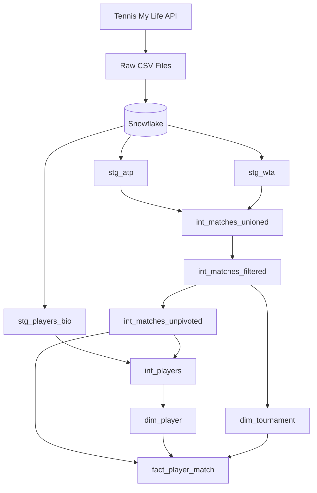

# 🎾 Tennis Analytics Engineering Project

This project uses 40+ years of ATP and WTA tennis match data to build a structured, analysis-ready data model in Snowflake. I'm using it to practise data warehouse design, dimensional modelling, dbt transformations, dbt testing, and documentation as part of my exploration of  **Analytics Engineering**.

> **Current stage:** Raw ingestion, staging, and intermediate transformation layers are complete and tested. Currently building the marts layer (dim_player, dim_tournament, fact_player_match).


## Analytics Request
For this project, I have imagined that a data analyst has requested analysis ready tennis data to investigate player serve styles using cluster analysis. As the Analytics Engineer on the team, my role is to design, transform, test and document the data models required to support the analysis. 


## Project Architecture




## Data Source

The project uses historical **ATP and WTA tennis match data** from Tennis My Life.

**Source:** [Tennis My Life – Tennis Match Database](https://stats.tennismylife.org/tennis-match-database)

The data contains information about tennis matches, players, tournaments, rankings, match results, and player performance statistics.

### Downloading the Raw Data

The raw files were downloaded locally using PowerShell and the Tennis My Life API:

```powershell
New-Item -ItemType Directory -Force -Path .\tml-data | Out-Null

Invoke-RestMethod -Uri 'https://stats.tennismylife.org/api/data-files' |
    Select-Object -ExpandProperty files |
    ForEach-Object {
        $outPath = Join-Path -Path '.\tml-data' -ChildPath $_.name
        $outDir = Split-Path -Path $outPath -Parent

        if (-not (Test-Path $outDir)) {
            New-Item -ItemType Directory -Force -Path $outDir | Out-Null
        }

        Invoke-WebRequest -Uri $_.url -OutFile $outPath
    }
```


## Snowflake Setup

* `01_setup_snowflake.sql` — creates the Snowflake warehouse, database, schema, file formats, and internal stage for the CSVs.
* `02_load_raw_csv.sql` — creates the raw tables and loads the CSVs into Snowflake.

Both scripts are commented throughout with the data quality issues encountered during loading and the reasoning behind each fix, a few examples: a player biography file discovered mixed in with the match files at the wrong grain, historical files with fewer columns than modern ones due to stats that weren't tracked yet, and column types Snowflake's schema inference guessed wrong from a limited sample. I've kept these decisions documented inline, since the reasoning is as much a part of this project as the final model.

At this stage, raw ATP, WTA, and player biographical data are loaded and available in Snowflake, providing the starting point for the dbt transformation layer.


## Data Modelling

### Grain

The grain at source is one match per row, with separate columns for the winner and loser. This means that every metric exists twice in a row. As the cluster analysis requires player level metric, I determined that the appropriate grain for the fact table is **one player in one tennis match**. Unpivoting the source data creates one set of performance statistics for each player in a match. 

Each row represents a single player's performance in a specific match. For a match between two players, there are therefore two records:

```text
Match 123
│
├── Player A → Win
└── Player B → Lose
```


## dbt Transformation Layers

### Staging (`stg_atp`, `stg_wta`, `stg_players_bio`)

Cleaned, 1:1 representations of the raw ATP and WTA match tables and the player biography table. This layer surfaced and resolved a substantial amount of source data quality issues, including:

* Player IDs shared between two different real players, and the same real player recorded under two different IDs (these issues were resolved with `player_id_corrections` and `player_id_merge_map` seeds)
* Duplicate match rows (exact source duplicates, deduplicated per tournament/round/players/score)
* Serve statistics that were internally inconsistent (e.g. first serves won exceeding first serves in). It was investigated, and where the correct values couldn't be confidently determined, serve stats were nulled out via a documented `match_stat_corrections` seed rather than guessed.
* Entry-code and seed-column formatting issues (inconsistent casing, compound values like `6/ITF`, entry codes leaked into the numeric seed column)
* Reusable generic tests (built as macros) applied across both `stg_atp` and `stg_wta`
* A stable `match_id` surrogate key built from tournament, date, players, and round


### Intermediate

* `int_matches_unioned`: Combines `stg_atp` and `stg_wta` into one table, tagged by `tour`
* `int_matches_filtered`: Scoped to matches from **2000 onward**, reflecting the modern era of the game. Excludes a small number of rows with no identifiable player on either side. Derives a `match_status` flag (Completed / Retired / Default) from the match score
* `int_matches_unpivoted`: Reshaped from one row per match to one row per player per match (the fact table grain), with a `player_match_id` surrogate key. Collapses the winner/loser entry codes into a single, consolidated `player_entry_category` column
* `int_players`: A reconciled player identity table. `stg_players_bio` alone only covers a subset of ATP players and no WTA players, so this model starts from every player who's actually appeared in a match (guaranteeing full coverage) and layers in whatever biographical data exists, flagging each row's data source (`bio_source`)

All models in this layer are tested (`unique`, `not_null`, `accepted_values`, and row-count checks between transformation steps) and documented, with design decisions and reasoning captured in `tennis_docs.md`.

### Marts
In progress


## Key Engineering Decisions - in progress
* Fact grain: one match per row --> one player per match per row
* Analysis Period: matches fromm 2000 onwards
* Player bio built
* Handling invalid player statistics
* Using dbt seeds for correction
* Separate ATP/WTA staging with shared downstream models


## Data Quality & Testing

**Status: Implemented for staging and intermediate layers.** Generic dbt tests (`unique`, `not_null`, `accepted_values`) plus custom singular and generic tests for known issues (player identity consistency, serve-stat validity) are in place across `stg_atp`, `stg_wta`, and the intermediate models. Known, accepted exceptions (e.g. two different real players who happen to share a name) are documented and set to `severity: warn` rather than blocking builds. Still planned: `relationships` (foreign key) tests once the fact/dimension tables are built.


## Documentation

**Status: In progress.** Model and column documentation exists for staging and intermediate models (`_int_layer.yml`, shared column descriptions via `{{ doc() }}` blocks). `tennis_docs.md` captures key design decisions and reasoning as they were made, analysis period cutoff, entry-code consolidation logic, data quality findings and fixes. Still planned: a generated dbt docs site, and documentation for the fact/dimension layer once built.


## Tech Stack

| Technology              | Purpose                                     |
| ----------------------  | --------------------------------------------|
| **Snowflake**           | Cloud data warehouse                        |
| **dbt**                 | Data transformation and modelling           |
| **SQL**                 | Data transformation and querying            |
| **PowerShell**          | Downloading raw data                        |
| **Git & GitHub**        | Version control                             |


## Project Roadmap

### Completed

* [x] Identify and download ATP/WTA tennis data
* [x] Set up Snowflake warehouse, database, and schemas
* [x] Load raw CSV data into Snowflake, resolving data quality issues along the way
* [x] Define the grain of the fact table
* [x] Design the `fact_player_match` table
* [x] Build staging models (`stg_atp`, `stg_wta`, `stg_players_bio`), including player identity and serve-stat corrections
* [x] Build intermediate models (union, filter to analysis period, unpivot to player-per-match grain, reconciled player identity)
* [x] Add dbt data quality tests for staging and intermediate layers, including reusable generic tests
* [x] Document staging and intermediate model design decisions

### In Progress

* [ ] Build `dim_player` and `dim_tournament`
* [ ] Build `fact_player_match` using dbt

### Planned

* [ ] Add `relationships` (foreign key) tests between fact and dimension tables
* [ ] Add dbt documentation for marts and generate a docs site
* [ ] Add CI/CD using GitHub Actions
* [ ] Document lessons learned and design decisions


## Lessons Learned - in progress


## Why I Built This Project

My background is in Data Analysis, which includes extraction, analysis, reporting, and visualisation. I'm now moving toward Analytics Engineering, and I wanted a project that would let me practise the skills behind building and maintaining the data layer that analysts and other data users actually work from, rather than just producing the final analysis.

This repository is both a learning project and a practical record of that transition, including the messier parts: data quality issues found and fixed, design decisions reconsidered, and the reasoning behind each one, documented as I went rather than cleaned up after the fact.
