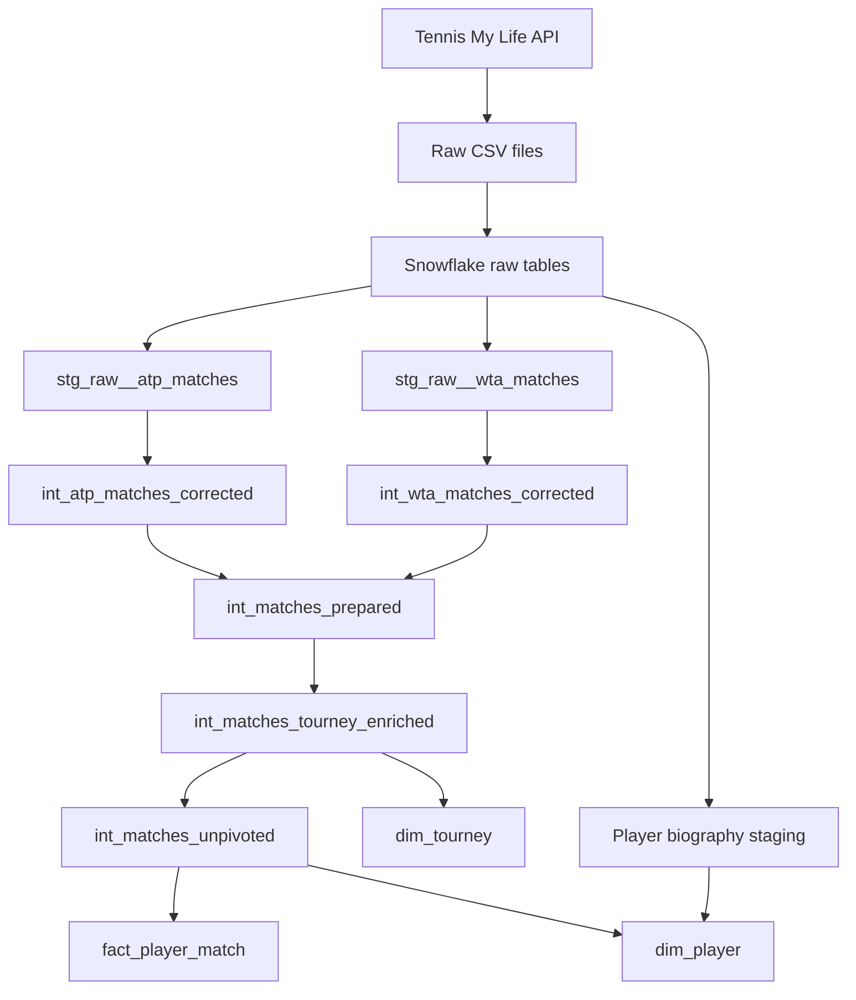

# 🎾 Tennis Analytics Engineering Project

An end-to-end analytics engineering project that transforms historical ATP and WTA tennis match data into a tested, documented dimensional model in Snowflake.

## Analytics Request
For this project, I have imagined that a data analyst has requested analysis ready tennis data to investigate player serve styles using cluster analysis. As the Analytics Engineer on the team, my role is to design, transform, test and document the data models required to support the analysis. 

## Project Status

Complete. Raw ingestion, dbt transformation layers, dimensional marts, documentation, testing, pull-request CI, and production deployment are implemented. The full project currently builds successfully.


## Project Architecture



## Data Source

The project uses historical ATP and WTA match data from the [Tennis My Life Tennis Match Database](https://stats.tennismylife.org/tennis-match-database). The source contains tournament details, player identities and rankings, match results, and serve statistics.

The raw files were downloaded through the source API and loaded into Snowflake using these scripts:

- `01_setup_snowflake.sql` creates the warehouse, database, schemas, file formats, and internal stage.
- `02_load_raw_csv.sql` creates and loads the raw tables.
- `03_profile_raw_data.sql` profiles source coverage, completeness, duplicates, player identity, serve statistics, and tournament consistency before modelling.

## Data Model

The source has one row per match, with separate winner and loser fields. It is reshaped into two player-match records to support player-level serve analysis.

### Marts

- `fact_player_match` contains match context, player and opponent keys, ranking and entry information at match time, and player-level serve statistics.
- `dim_player` contains canonical player identities and reconciled biographical attributes.
- `dim_tourney` contains one row per canonical tournament edition.

Surface is retained in the fact table because Davis Cup and Billie Jean King Cup tournament groupings can contain matches played on different surfaces. It is therefore not always stable at tournament grain.

## Transformation Design

- **Staging:** source-aligned renaming, type casting, and mechanical whitespace cleaning while preserving raw values.
- **Tour-specific intermediate models:** reviewed ATP/WTA corrections and duplicate handling.
- **Shared intermediate models:** unioning, the post-2000 analysis filter, tournament enrichment, and reshaping to player-match grain.
- **Marts:** dimensional models designed for analysis.

Known corrections are stored in version-controlled dbt seeds instead of embedded in large `CASE` statements. Raw identifiers are retained alongside corrected and canonical identifiers for traceability.

## Data Quality & Testing

The project includes source profiling, reusable generic tests, singular transformation checks, primary-key and relationship tests, accepted-value checks, and stored test failures for investigation. Reviewed corrections and legitimate exceptions are handled separately so known source behaviour does not hide new issues.

Detailed findings, correction logic, test design, and accepted exceptions are documented in [tennis_docs.md](tennis_docs.md#data-quality-and-testing).

## CI/CD

CI/CD uses dbt's native GitHub integration and job orchestration. Pull requests are tested in isolated schemas, a GitHub ruleset requires the `dbt Cloud` status check before merge, and successful merges trigger a full Production build.

- Pull-request CI: `dbt build --select +state:modified+`
- Production deployment: `dbt build`

The full workflow is documented in [tennis_docs.md](tennis_docs.md#cicd).

## Key Engineering Decisions

- Defined the fact grain from the analytical requirement: one player per match.
- Limited the supported analysis period to matches from 2000 onward.
- Kept staging close to source and moved reviewed business corrections into intermediate models.
- Used auditable seeds for player, match-stat, and tournament corrections.
- Excluded unverifiable conflicting duplicate versions rather than choosing one without evidence.
- Retained surface at match grain where tournament-level consistency does not hold.

More detailed reasoning is available in [tennis_docs.md](tennis_docs.md).

## Tech Stack

| Technology | Purpose |
|---|---|
| Snowflake | Cloud data warehouse |
| dbt | Transformation, testing, documentation, and deployment |
| SQL | Ingestion and transformation logic |
| PowerShell | Raw-file download automation |
| Git and GitHub | Version control, pull requests, and branch protection |
| dbt-utils | Surrogate keys, tests, and utility macros |
| dbt-codegen | Initial documentation skeletons |

## Run the Project

```bash
dbt deps
dbt build
```

## Documentation

- [Technical decisions, data quality, testing, and CI/CD](tennis_docs.md)
- Model and column definitions are maintained in dbt YAML files and reusable `doc()` blocks.

## Why I Built This Project

My background is in Data Analysis, including extraction, reporting, analysis, and visualisation. This project gave me practical experience designing the tested, documented, and deployable data models that analysts and other data users depend on.
